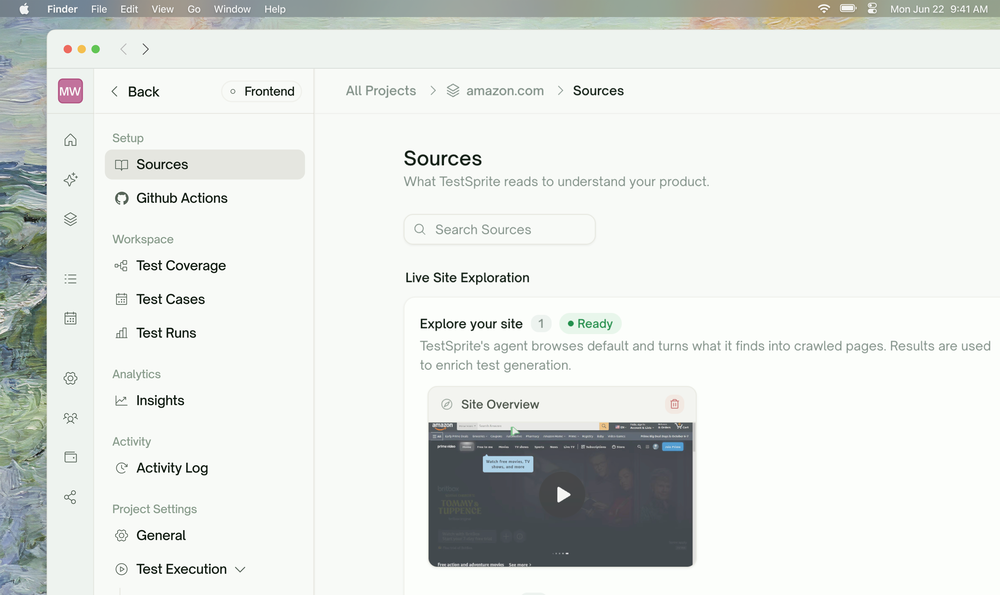
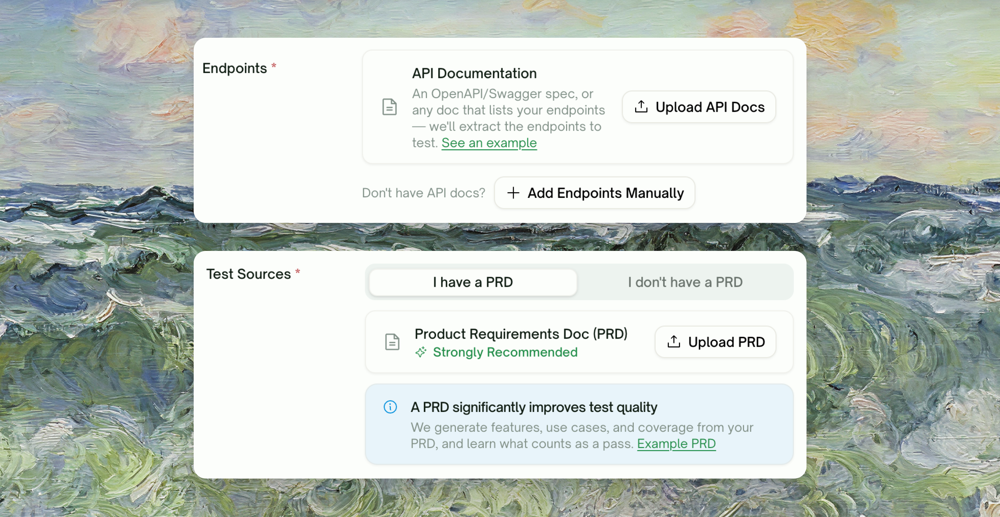
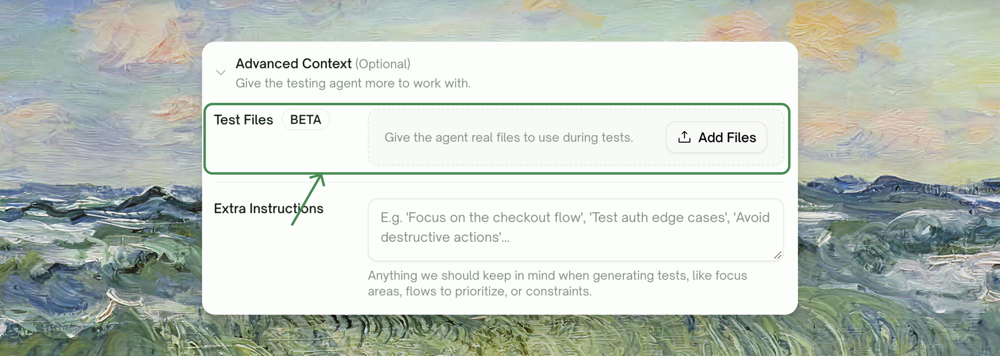
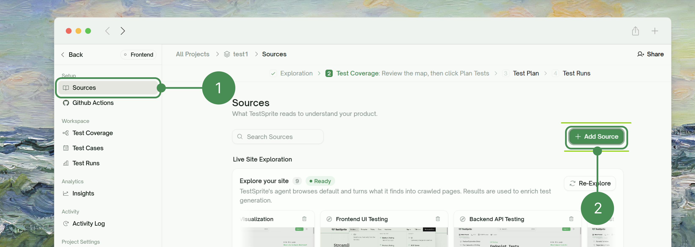

TestSprite learns about your product from whatever sources you feed it. Pick based on what you already have and how deep you want it to dig.

<Frame>
  
</Frame>

<CardGroup cols={2}>
  <Card title="PRD Upload" icon="file-lines">
    Your product requirements doc. Features, use cases, and test coverage are generated directly from it.
  </Card>
  <Card title="API Doc Upload" icon="code">
    An OpenAPI/Swagger spec, or any doc listing your endpoints. **Backend only** — auto-discovers endpoints for you to review before testing starts.
  </Card>
  <Card title="Agent Web Exploration" icon="compass">
    TestSprite's agent browses your live frontend and clicks through flows on its own. Runs automatically after you create a Frontend project; re-run anytime.
  </Card>
  <Card title="Test Files (Fixtures)" icon="paperclip">
    <kbd>Beta</kbd> Files the agent attaches when a test hits a file-upload field.
  </Card>
</CardGroup>

Both uploads live on the project-creation form — PRD is offered for either project type, API doc only for Backend:

<Frame>
  
</Frame>

## Test Files

<kbd>Beta</kbd>. Not every plan includes Test Files. Compare plans on the [pricing page](https://www.testsprite.com/pricing).

<Frame>
  
</Frame>

## Adding a Source Later

You're not limited to what you add at project creation. Go to <kbd>Setup → Sources</kbd> and click <kbd>+ Add Source</kbd> to upload more sources at any point. The same page also shows your Live Site Exploration status and every page it's captured so far.

<Frame>
  
</Frame>

## Endpoint Discovery & Selection

For Backend projects, endpoints only come from an uploaded API doc — there's no separate crawl or agent-exploration path to discover them. After upload, TestSprite parses the doc and shows every discovered endpoint in a reviewable list where you can remove ones you don't want tested, add endpoints manually, or fix flagged coverage gaps (e.g. a resource with no matching `POST`) before saving.

## Combining Sources

The most common pairing is **PRD + Agent web exploration**: the PRD drives what gets generated, and exploration fills in how the app actually behaves. For Backend projects, **API doc** is the source endpoint tests are generated from, with **PRD** still driving feature-level coverage alongside it.

## Where to Go Next

<CardGroup cols={2}>
  <Card title="Run Behavior" href="/web-portal/setup/execution-settings" icon="sliders">
    Configure how your tests run once sources are in place
  </Card>
  <Card title="Environments" href="/web-portal/setup/environments" icon="layer-group">
    Define environment variables and run against dev/staging/prod
  </Card>
  <Card title="Feature Exploration" href="/web-portal/core/ui/feature-exploration" icon="compass">
    How TestSprite explores your live app feature by feature
  </Card>
  <Card title="How It Works" href="/web-portal/getting-started/overview#how-it-works" icon="play">
    Haven't created a project yet? Start here
  </Card>
</CardGroup>
